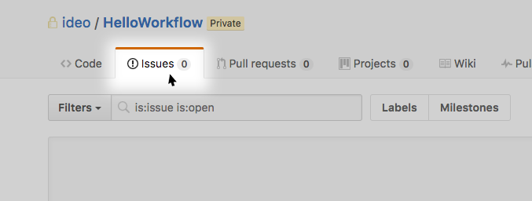
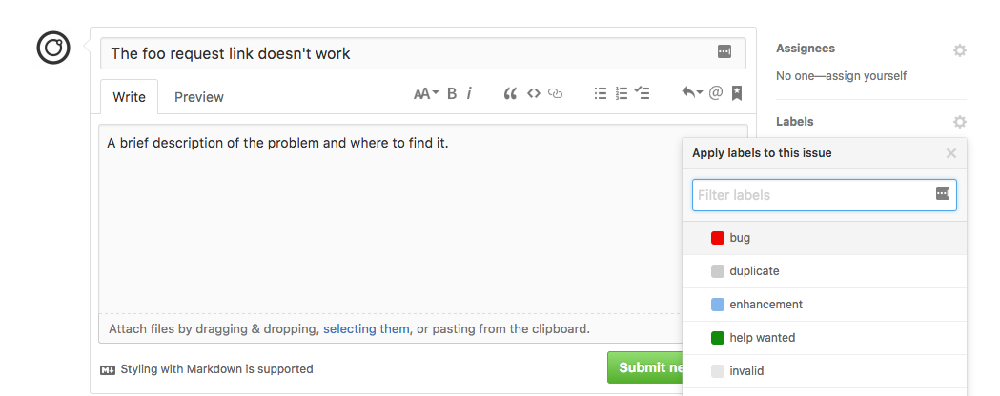

# IDEO Software Collaboration Guidelines

### Table of contents:
1. [Overview](#overview)
2. [Issues](#issues)
3. [Branching](#branching)
4. [Commits](#commits)
5. [Pull Requests](#foo-requests)
6. [Example Workflow](#example-workflow)
7. [Resources](#resources)


## Overview

This document is intended to lay out a framework for collaborating on long-running software projects at IDEO. Although, many client projects are fast-paced and short-lived, there is a growing trend of projects that are beginning to toe the line of production-like code. In order to maintain the integrity of our designs and demonstrate our competency as software practitioners, we must adopt software best practices when collaborating with others. This is especially important when collaborating with outside software vendors, or when handing off code to client software teams.

This document assumes a basic knowledge of Git. Though, an excellent resource for getting started with Git is the [Pro Git Book.](https://git-scm.com/book/en/) While IDEO utilizes Github, which has fantastic features and tools for collaboration, these best-practices can be applied to several other platforms like BitBucket and Gitlab.

## Issues



Github issues are an excellent foundation for a collaborative workflow. Not only are they a great way to keep track of bugs, they should also be used for recommending improvements and new features. Once an issue is opened and discussed it should be labeled assigned to a project contributor.

### Labels

Labels are a way to categorize your issues. A great use of labels is to assign priority to a certain task (ex: Blocking, High, Med, Low). You can also use labels to tag issues as bug fixes or new features. Classifying your issues in this way makes them easy to filter and search.



### Milestones

Milestones are a way to group issues together. This provides a way to define sub-tasks that might be required towards completing a new feature or release. In projects, milestones can be organized as sprints, which contributors can assign and work on. As issues in a milestone are closed contributors will see the progress towards completing that milestone.

## Branching

There has been much debate in the software development world over branching strategies. Do we use git-flow? Individual project forks? Screw it, just put everything on master! All of these methods have their benefits and drawbacks, but for simplicity, long-running IDEO software projects should adopt the _Feature Branch_ workflow.

### Feature Branch Workflow

The basic principle behind the feature branch workflow is that all work on a new feature, revision, or bug fix should take place in its own dedicated branch. The feature branch should be pushed up to github regularly. This allows multiple developers to work collaboratively, while keeping the `master` branch stable and free from containing broken code. 

This workflow also leverages [pull requests](#pull-requests) - encouraging discussions around new features, facilitating code reviews, and enabling isolated testing - before new code is merged into the master branch.

The `master` branch should reflect code currently running in production and should be kept up-to-date and stable at all times.

### Branch Naming Conventions

Branches should have descriptive names in order to easily identify what work is being done there. For instance, namespacing a feature branch `feature/feature-name` or a bug fix `fix/description` or `fix/issue-number` provides a glanceable view into work happening in the codebase.


## Commits

### Commit Messages

Commit messages are important for describing the context around changes to a code-base. The commit's contents will show what has changed, but the commit message is how a software developer communicates _why_ a change was made to fellow contributors.


> Don't do this...

**Example Commit Message:**

```
Short summary of this commit (<50 characters)

More descriptive context, if necessary.

This closes #123
```

**Best Practices:**

* Write a present-tense, concise summary line in an imperative style (describe what the commit does, not what you did)
	- A properly formed commit summary should complete this sentence: <br/>_If applied, this commit will **[your subject line]**_
	- :thumbsup: - `Add a feature` or `Fix evil bug` or `Enable foo`
	- :thumbsdown: - `Added a feature` or `Fixed evil bug` or `Misc stuff`
* Leave the second line blank
* Write a short description explaining any details
* [Automatically reference](https://help.github.com/articles/closing-issues-via-commit-messages/) any related github issues by adding `closes #123` or `resolves #321` to your commit message

### Commiting Code

> "Leave the campground cleaner than you found it"

* Don't commit code with [trailing whitespaces](https://gist.github.com/4451806).
* Make sure there is a [new-line at the end of each file](https://robots.thoughtbot.com/no-newline-at-end-of-file).
* Refrain from using `git push --force`, doing so will have detrimental effects for others contributing to the repo. Only do so when it is absolutely necessary.


## Pull Requests

Contributors should utilize pull requests to merge all new code to master. This gives all contributors a chance to review new code, discuss problems and solutions, and test the feature, before broken code potentially gets shipped to production code. Pull requests also help maintain a history of the changes made to the project as well as the reasoning behind them, which can be useful to future contributors to the project.

Pull requests should engage multiple team members so more ideas and knowledge about the codebase are shared - Github has some great tools for doing [code reviews](https://help.github.com/articles/about-pull-request-reviews/) and encouraging conversation within your code through [inline comments](https://help.github.com/articles/commenting-on-a-pull-request/#adding-line-comments-to-a-pull-request).

When feasible, utilize [protected branches](https://help.github.com/articles/about-protected-branches/) to require pull requests and passing tests before code is merged to master.

Once a pull request is successfully merged to master the associated branch should be [deleted](https://help.github.com/articles/deleting-unused-branches/) to clean up the repo.


## Example Workflow

1. Contributor opens a github issue describing a new feature or bugfix.
2. After feature is approved, contributor creates a new feature branch to perform the work in.
3. Contributor pushes their work regularly to their branch on the main repo.
4. Once the work has been completed, contributor opens a new pull request from their working branch to master. Add @mentions to other project contributors asking for a review.
5. Peer contributors review the changes and add comments and suggestions.
6. If everything looks good (format, tests pass, etc.), project maintainer merges code to master.

## Resources

* [Pro Git Book](https://git-scm.com/book/en/) - learn everything git can do. 
* [Try Github](https://try.github.io) - interactive git / github lesson to cover the basics.
* [Atlassian Feature Branching](http://blogs.atlassian.com/2013/10/inside-atlassian-feature-branching-on-the-stash-team/) - how and why Atlassian uses the feature branch workflow.

